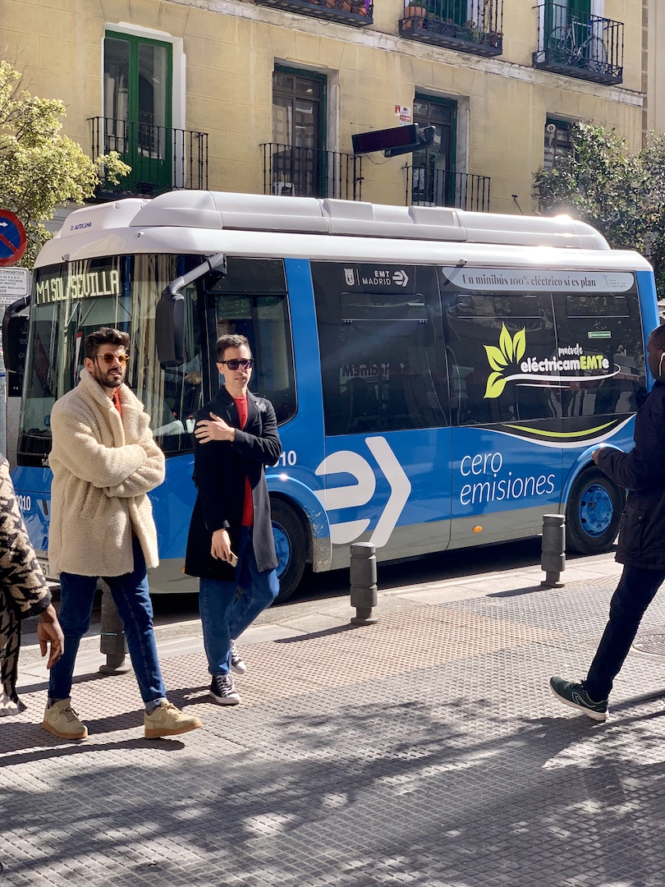
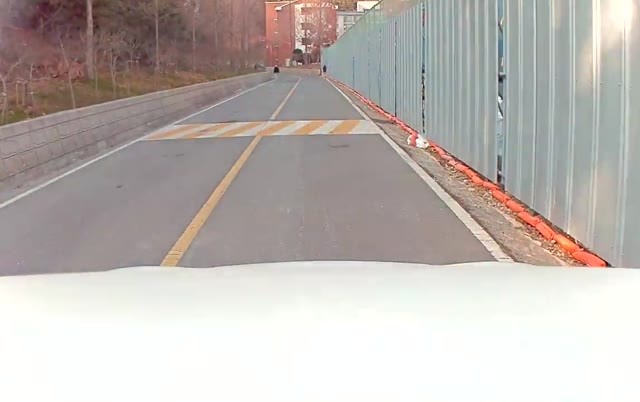
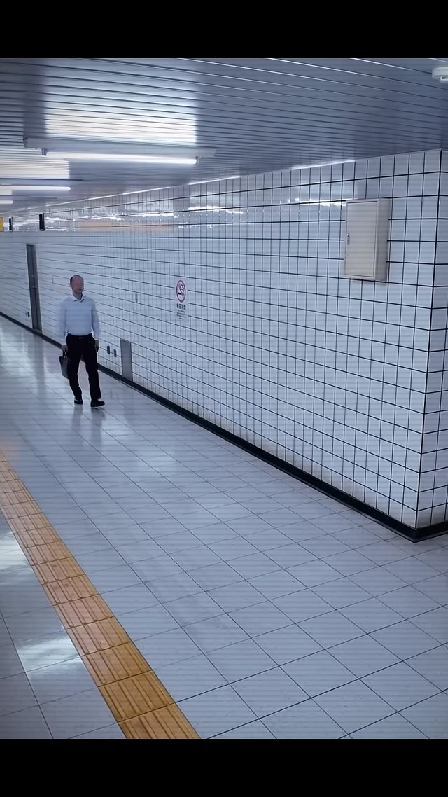
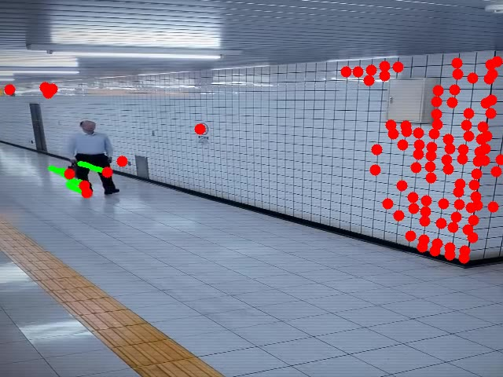
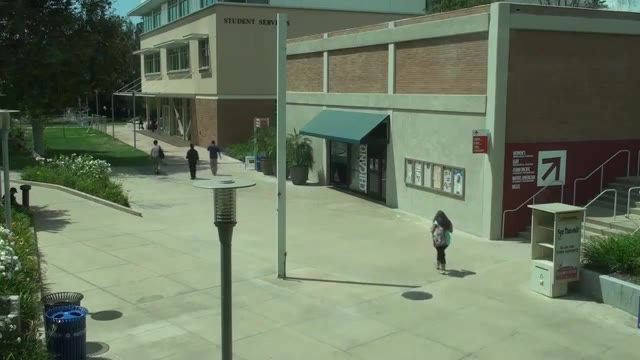
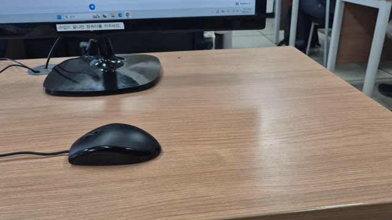

# 전주여고 마스터 클래스

**Computer Vision · Deep Learning · Robotics**

 

 

객체 인식부터 로봇 자율주행까지 — **9개 실습**으로 익히는 AI·로봇 실전 커리큘럼

[📖 실습 상세](docs/exercises.md) · [🌐 웹 페이지](https://fjdnfrh123-dev.github.io/jeonju-yeo-go-masterclass/)

---

## Curriculum

| # | 실습 | 상태 | Colab | 비고 |
|:-:|------|:----:|:-----:|------|
| **01** | 객체 인식 | `Ready` | [▶](https://colab.research.google.com/drive/14oVqYHSUHidtCF5bH8OxbQsESjNZ5mNV?hl=ko#scrollTo=qYpXtka5nezB) | YOLO · bus.jpg · NIRO.mp4 |
| **02** | 특징점 추적 · 영상 움직임 분석 | `Ready` | [▶](https://colab.research.google.com/drive/1LU01gmea1DX2alSdUuqvjB6L0iJUdBqg?hl=ko#scrollTo=0a95549f) | Optical Flow · VIRAT · 학생 결과 |
| **03** | YOLO + 특징점 추적 | `Ready` | [▶](https://colab.research.google.com/drive/1lYJz_rAKCN72N13hmtpiR_zdWgjqr6BI?hl=ko#scrollTo=1884ead8) | Detection + Tracking |
| **04** | 웹캡 검출 · 분할 · 추적 · 포즈 | `Note` | — | *webcam pipeline · Detect / Segment / Track / Pose* |
| **05** | 생성형 AI & 바이브코딩 | `Note` | — | *Youtube→MP4 · 축구 · 모션캡처 · Vibe coding* |
| **06** | 연구실 플랫폼 소개 | `Note` | — | *Lab platform · 연구 인프라* |
| **07** | 매니퓰레이터 · 모방학습 시뮬 | `Note` | — | *Imitation learning · simulation* |
| **08** | 매핑 + 자율주행 | `Note` | — | *SLAM · autonomous navigation* |
| **09** | 로봇개 매핑 / 주행 | `Note` | — | *Quadruped · mapping · locomotion* |

---

## Preview

<table>
<tr>
<td width="33%" align="center">

**01 · Detection**

[`bus.jpg`](assets/images/bus.jpg)

</td>
<td width="33%" align="center">

**01 · NIRO**

[`NIRO.mp4`](assets/videos/NIRO.mp4)

</td>
<td width="33%" align="center">

**02 · Tracking**

[`실습_예시.mp4`](assets/videos/실습_예시.mp4)

</td>
</tr>
<tr>
<td align="center">

**02 · Result**

[`실습결과.mp4`](assets/videos/실습결과.mp4)

</td>
<td align="center">

**02 · VIRAT**

[`VIRAT.mp4`](assets/videos/VIRAT_Dataset_Sample.mp4)

</td>
<td align="center">

**03 · YOLO+Track**

[`학생_실습_예시.mp4`](assets/videos/학생_실습_예시.mp4)

</td>
</tr>
<tr>
<td align="center">

**04 · Note**

*Webcam · Pose*

</td>
<td align="center">

**05 · Note**

*Gen-AI · Vibe Coding*

</td>
<td align="center">

**08 · Note**

*Autonomous Drive*

</td>
</tr>
</table>

---

## Media Gallery

<b>▶ 영상 미리보기 (클릭해서 재생)</b>

 

**NIRO.mp4**

<video src="assets/videos/NIRO.mp4" controls width="100%"></video>

**실습_예시.mp4**

<video src="assets/videos/실습_예시.mp4" controls width="100%"></video>

**학생_실습_예시.mp4**

<video src="assets/videos/학생_실습_예시.mp4" controls width="100%"></video>

---

전주여고 마스터 클래스 · <a href="https://fjdnfrh123-dev.github.io/jeonju-yeo-go-masterclass/">웹에서 보기</a>

