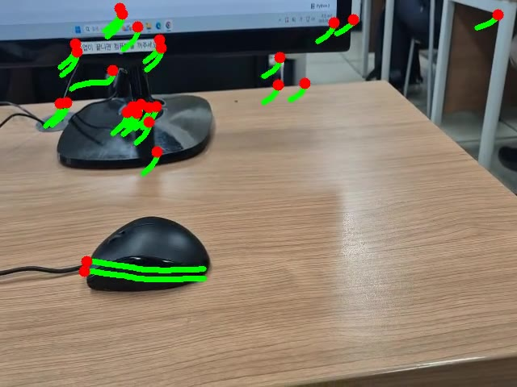

# 실습 상세

[← README](../README.md) · [🌐 웹 페이지](https://fjdnfrh123-dev.github.io/jeonju-yeo-go-masterclass/)

---

## 01 · 객체 인식 `Ready`

| | |
|---|---|
| **Colab** | [노트북 열기](https://colab.research.google.com/drive/14oVqYHSUHidtCF5bH8OxbQsESjNZ5mNV?hl=ko#scrollTo=qYpXtka5nezB) |
| **이미지** | [bus.jpg](../assets/images/bus.jpg) |
| **영상** | [NIRO.mp4](../assets/videos/NIRO.mp4) |

<video src="../assets/videos/NIRO.mp4" controls width="100%"></video>

---

## 02 · 특징점 추적 · 영상 움직임 분석 `Ready`

<table>
<tr>
<td> <a href="../assets/videos/실습_예시.mp4">실습_예시</a></td>
<td> <a href="../assets/videos/실습결과.mp4">실습결과</a></td>
<td> <a href="../assets/videos/VIRAT_Dataset_Sample.mp4">VIRAT</a></td>
<td> <a href="../assets/videos/학생_실습_결과.mp4">학생 결과</a></td>
</tr>
</table>

| | |
|---|---|
| **Colab** | [노트북 열기](https://colab.research.google.com/drive/1LU01gmea1DX2alSdUuqvjB6L0iJUdBqg?hl=ko#scrollTo=0a95549f) |

---

## 03 · YOLO + 특징점 추적 `Ready`

| | |
|---|---|
| **Colab** | [노트북 열기](https://colab.research.google.com/drive/1lYJz_rAKCN72N13hmtpiR_zdWgjqr6BI?hl=ko#scrollTo=1884ead8) |
| **영상** | [학생_실습_예시.mp4](../assets/videos/학생_실습_예시.mp4) |

<video src="../assets/videos/학생_실습_예시.mp4" controls width="100%"></video>

---

## 04 · 웹캡 검출 · 분할 · 추적 · 포즈 `Note`

> **비고 · 미리보기** — Detection → Segmentation → Tracking → Pose Estimation

---

## 05 · 생성형 AI & 바이브코딩 `Note`

> **비고 · 미리보기** — Youtube → MP4 · 축구 영상 · 모션 캡처 · Vibe Coding

---

## 06 · 연구실 플랫폼 소개 `Note`

> **비고 · 미리보기** — Lab platform · 연구 인프라 · 도구 생태계

---

## 07 · 매니퓰레이터 · 모방학습 시뮬 `Note`

> **비고 · 미리보기** — Imitation Learning · Manipulator Simulation

---

## 08 · 매핑 + 자율주행 `Note`

> **비고 · 미리보기** — SLAM · Mapping · Autonomous Navigation

---

## 09 · 로봇개 매핑 / 주행 `Note`

> **비고 · 미리보기** — Quadruped Robot · Mapping · Locomotion
